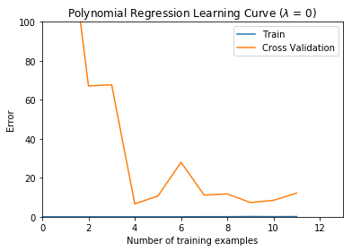

## Exercise 5 | Regularized Linear Regression and Bias-Variance
### =========== Part 1: Loading and Visualizing Data =============


```python
from ex5 import *
from scipy import io as sio
# Load Training Data
print('Loading and Visualizing Data ...')

# Load from ex5data1: 
# You will have X, y, Xval, yval, Xtest, ytest in your environment
data = sio.loadmat ('ex5data1.mat')
X = data['X'].reshape(-1)
y = data['y'].reshape(-1)
Xval = data['Xval'].reshape(-1)
yval = data['yval'].reshape(-1)
Xtest = data['Xtest'].reshape(-1)
ytest = data['ytest'].reshape(-1)

# m = Number of examples
m = X.shape[0]

# Plot training data
%matplotlib inline
plt.plot(X, y, 'rx', markersize=10, markeredgewidth=1.5)
plt.xlabel('Change in water level (x)')
plt.ylabel('Water flowing out of the dam (y)')
plt.show()
```

    Loading and Visualizing Data ...
    


### =========== Part 2: Regularized Linear Regression Cost =============


```python
theta = np.array([1, 1])
J, _ = linearRegCostFunction(np.column_stack([np.ones(m), X]), y, theta, 1)

print(f'Cost at theta = [1 ; 1]: {J:f} '
         '\n(this value should be about 303.993192)')
```

    Cost at theta = [1 ; 1]: 303.993192 
    (this value should be about 303.993192)
    

### =========== Part 3: Regularized Linear Regression Gradient =============


```python
theta = np.array([1, 1])
J, grad = linearRegCostFunction(np.column_stack([np.ones(m), X]), y, theta, 1)

print(f'Gradient at theta = [1 ; 1]:  [{grad[0]:f}; {grad[1]:f}] '
         '\n(this value should be about [-15.303016; 598.250744])')
```

    Gradient at theta = [1 ; 1]:  [-15.303016; 598.250744] 
    (this value should be about [-15.303016; 598.250744])
    

### =========== Part 4: Train Linear Regression =============


```python
#  Train linear regression with lambda = 0
lambda_ = 0;
theta = trainLinearReg(np.column_stack([np.ones(m), X]), y, lambda_)

#  Plot fit over the data
plt.plot(X, y, 'rx', markersize=10, markeredgewidth=1.5)
plt.xlabel('Change in water level (x)')
plt.ylabel('Water flowing out of the dam (y)')
plt.plot(X, np.matmul(np.column_stack([np.ones(m), X]), theta), '--', linewidth=2)
plt.show()
```

    Optimization terminated successfully.
             Current function value: 22.373906
             Iterations: 2
             Function evaluations: 5
             Gradient evaluations: 5
    


### =========== Part 5: Learning Curve for Linear Regression =============


```python
lambda_ = 0
error_train, error_val = learningCurve(np.column_stack([np.ones(m), X]), y,
                                       np.column_stack([np.ones_like(Xval), Xval]), yval, lambda_)

plt.plot(np.arange(m), error_train)
plt.plot(np.arange(m), error_val)
plt.title('Learning curve for linear regression')
plt.legend(['Train', 'Cross Validation'])
plt.xlabel('Number of training examples')
plt.ylabel('Error')
plt.axis([0, 13, 0, 150])

print('# Training Examples\tTrain Error\tCross Validation Error')
for i in range(m):
    print(f'  \t{i}\t\t{error_train[i]:f}\t{error_val[i]:f}')
```

    Optimization terminated successfully.
             Current function value: 0.000000
             Iterations: 1
             Function evaluations: 3
             Gradient evaluations: 3
    Optimization terminated successfully.
             Current function value: 0.000000
             Iterations: 2
             Function evaluations: 6
             Gradient evaluations: 6
    Optimization terminated successfully.
             Current function value: 3.286595
             Iterations: 9
             Function evaluations: 15
             Gradient evaluations: 15
    Optimization terminated successfully.
             Current function value: 2.842678
             Iterations: 8
             Function evaluations: 14
             Gradient evaluations: 14
    Optimization terminated successfully.
             Current function value: 13.154049
             Iterations: 22
             Function evaluations: 34
             Gradient evaluations: 34
    Optimization terminated successfully.
             Current function value: 19.443963
             Iterations: 22
             Function evaluations: 34
             Gradient evaluations: 34
    Optimization terminated successfully.
             Current function value: 20.098522
             Iterations: 18
             Function evaluations: 28
             Gradient evaluations: 28
    Optimization terminated successfully.
             Current function value: 18.172859
             Iterations: 2
             Function evaluations: 5
             Gradient evaluations: 5
    Optimization terminated successfully.
             Current function value: 22.609405
             Iterations: 2
             Function evaluations: 5
             Gradient evaluations: 5
    Optimization terminated successfully.
             Current function value: 23.261462
             Iterations: 2
             Function evaluations: 5
             Gradient evaluations: 5
    Optimization terminated successfully.
             Current function value: 24.317250
             Iterations: 2
             Function evaluations: 5
             Gradient evaluations: 5
    Optimization terminated successfully.
             Current function value: 22.373906
             Iterations: 2
             Function evaluations: 5
             Gradient evaluations: 5
    # Training Examples	Train Error	Cross Validation Error
      	0		0.000000	205.121096
      	1		0.000000	110.300366
      	2		3.286595	45.010232
      	3		2.842678	48.368911
      	4		13.154049	35.865141
      	5		19.443963	33.829957
      	6		20.098522	31.970987
      	7		18.172859	30.862446
      	8		22.609405	31.135998
      	9		23.261462	28.936207
      	10		24.317250	29.551432
      	11		22.373906	29.433818
    


### =========== Part 6: Feature Mapping for Polynomial Regression =============


```python
p = 8

# Map X onto Polynomial Features and Normalize
X_poly = polyFeatures(X, p)
X_poly, mu, sigma = featureNormalize(X_poly)  # Normalize
X_poly = np.insert(X_poly, 0, 1, axis=1)      # Add Ones

# Map X_poly_test and normalize (using mu and sigma)
X_poly_test = polyFeatures(Xtest, p)
X_poly_test = X_poly_test - mu
X_poly_test = X_poly_test / sigma
X_poly_test = np.insert(X_poly_test, 0, 1, axis=1)  # Add Ones

# Map X_poly_val and normalize (using mu and sigma)
X_poly_val = polyFeatures(Xval, p)
X_poly_val = X_poly_val - mu
X_poly_val = X_poly_val / sigma
X_poly_val = np.insert(X_poly_val, 0, 1, axis=1)  # Add Ones

print('Normalized Training Example 1:')
print(f'  {X_poly[0, :]}  ')
```

    Normalized Training Example 1:
      [ 1.       -0.378244 -0.788662  0.190329 -0.737591  0.320252 -0.617152
      0.359835 -0.531091]  
    

### =========== Part 7: Learning Curve for Polynomial Regression =============


```python
lambda_ = 0;
theta = trainLinearReg(X_poly, y, lambda_)

# Plot training data and fit
plt.figure()
plt.plot(X, y, 'rx', markersize=10, markeredgewidth=1.5)
plotFit(min(X), max(X), mu, sigma, theta, p);
plt.xlabel('Change in water level (x)')
plt.ylabel('Water flowing out of the dam (y)')
plt.title(f'Polynomial Regression Fit ($\lambda$ = {lambda_:g})')
plt.show()

plt.figure()
error_train, error_val = learningCurve(X_poly, y, X_poly_val, yval, lambda_)
plt.plot(np.arange(m), error_train)
plt.plot(np.arange(m), error_val)

plt.title(f'Polynomial Regression Learning Curve ($\lambda$ = {lambda_:g})')
plt.xlabel('Number of training examples')
plt.ylabel('Error')
plt.axis([0, 13, 0, 100])
plt.legend(['Train', 'Cross Validation'])

print(f'Polynomial Regression (lambda = {lambda_:g})\n')
print('# Training Examples\tTrain Error\tCross Validation Error')
for i in range(m):
    print(f'  \t{i}\t\t{error_train[i]:f}\t{error_val[i]:f}')
```

    Warning: Maximum number of iterations has been exceeded.
             Current function value: 0.119425
             Iterations: 200
             Function evaluations: 372
             Gradient evaluations: 372
    


    Optimization terminated successfully.
             Current function value: 0.000000
             Iterations: 2
             Function evaluations: 4
             Gradient evaluations: 4
    Optimization terminated successfully.
             Current function value: 0.000000
             Iterations: 6
             Function evaluations: 9
             Gradient evaluations: 9
    Optimization terminated successfully.
             Current function value: 0.000000
             Iterations: 15
             Function evaluations: 27
             Gradient evaluations: 27
    Optimization terminated successfully.
             Current function value: 0.000000
             Iterations: 4
             Function evaluations: 13
             Gradient evaluations: 13
    Optimization terminated successfully.
             Current function value: 0.000000
             Iterations: 17
             Function evaluations: 35
             Gradient evaluations: 35
    Optimization terminated successfully.
             Current function value: 0.000000
             Iterations: 37
             Function evaluations: 72
             Gradient evaluations: 72
    Optimization terminated successfully.
             Current function value: 0.000000
             Iterations: 147
             Function evaluations: 274
             Gradient evaluations: 274
    Warning: Maximum number of iterations has been exceeded.
             Current function value: 0.040218
             Iterations: 200
             Function evaluations: 380
             Gradient evaluations: 380
    Warning: Maximum number of iterations has been exceeded.
             Current function value: 0.035614
             Iterations: 200
             Function evaluations: 366
             Gradient evaluations: 366
    Warning: Maximum number of iterations has been exceeded.
             Current function value: 0.131620
             Iterations: 200
             Function evaluations: 371
             Gradient evaluations: 371
    Warning: Maximum number of iterations has been exceeded.
             Current function value: 0.068496
             Iterations: 200
             Function evaluations: 350
             Gradient evaluations: 350
    Warning: Maximum number of iterations has been exceeded.
             Current function value: 0.119425
             Iterations: 200
             Function evaluations: 372
             Gradient evaluations: 372
    Polynomial Regression (lambda = 0)
    
    # Training Examples	Train Error	Cross Validation Error
      	0		0.000000	161.442168
      	1		0.000000	160.792292
      	2		0.000000	67.084922
      	3		0.000000	67.726849
      	4		0.000000	6.616987
      	5		0.000000	10.643050
      	6		0.000000	27.963489
      	7		0.040218	11.105429
      	8		0.035614	11.714711
      	9		0.131620	7.300176
      	10		0.068496	8.426525
      	11		0.119425	12.112653
    





### =========== Part 8: Validation for Selecting Lambda =============


```python
lambda_vec, error_train, error_val = validationCurve(X_poly, y, X_poly_val, yval)

plt.plot(lambda_vec, error_train)
plt.plot(lambda_vec, error_val)
plt.legend(['Train', 'Cross Validation'])
plt.xlabel('$\lambda$')
plt.ylabel('Error')

print('lambda\t\tTrain Error\tValidation Error')
for i in range(len(lambda_vec)):
    print(f' {lambda_vec[i]:f}\t{error_train[i]:f}\t{error_val[i]:f}')
```

    Warning: Maximum number of iterations has been exceeded.
             Current function value: 0.119425
             Iterations: 200
             Function evaluations: 372
             Gradient evaluations: 372
    Warning: Maximum number of iterations has been exceeded.
             Current function value: 0.180723
             Iterations: 200
             Function evaluations: 370
             Gradient evaluations: 370
    Optimization terminated successfully.
             Current function value: 0.243172
             Iterations: 195
             Function evaluations: 377
             Gradient evaluations: 377
    Warning: Maximum number of iterations has been exceeded.
             Current function value: 0.371283
             Iterations: 200
             Function evaluations: 377
             Gradient evaluations: 377
    Optimization terminated successfully.
             Current function value: 0.636703
             Iterations: 118
             Function evaluations: 218
             Gradient evaluations: 218
    Optimization terminated successfully.
             Current function value: 1.360572
             Iterations: 78
             Function evaluations: 146
             Gradient evaluations: 146
    Optimization terminated successfully.
             Current function value: 2.917649
             Iterations: 61
             Function evaluations: 101
             Gradient evaluations: 101
    Optimization terminated successfully.
             Current function value: 6.830463
             Iterations: 34
             Function evaluations: 62
             Gradient evaluations: 62
    Optimization terminated successfully.
             Current function value: 14.937646
             Iterations: 13
             Function evaluations: 24
             Gradient evaluations: 24
    Optimization terminated successfully.
             Current function value: 31.878154
             Iterations: 15
             Function evaluations: 25
             Gradient evaluations: 25
    lambda		Train Error	Validation Error
     0.000000	0.119425	12.112653
     0.001000	0.146681	15.167242
     0.003000	0.166711	15.938570
     0.010000	0.218028	17.154297
     0.030000	0.275169	13.215280
     0.100000	0.438662	7.926893
     0.300000	0.868160	4.760834
     1.000000	1.958695	4.263359
     3.000000	4.525105	3.832176
     10.000000	14.825808	8.889725
    


### Computing test set error
可以看到，当$$\lambda = 3$$时验证集误差最小


```python
lambda_ = 3
theta = trainLinearReg(X_poly, y, lambda_)
error_test = linearRegCostFunction(X_poly_test, ytest, theta, 0)[0]
print(f'Error at lambda = 3:  {error_test:f} '
         '\n(this value should be about 3.8599)')
```

    Optimization terminated successfully.
             Current function value: 14.937646
             Iterations: 13
             Function evaluations: 24
             Gradient evaluations: 24
    Error at lambda = 3:  3.572027 
    (this value should be about 3.8599)
    

### Plotting learning curves with randomly selected examples
比较复杂，关掉迭代过程显示，重新写一遍


```python
lambda_ = 0.01
repeat = 50

m = X_poly.shape[0]
error_train = np.zeros(m)
error_val = np.zeros(m)

for i in range(m):
    # Initialize Theta
    initial_theta = np.zeros(X_poly.shape[1])

    # Create "short hand" for the cost function to be minimized
    costFunction = lambda t, X, y: linearRegCostFunction(X, y, t, lambda_)[0]
    gradFunction = lambda t, X, y: linearRegCostFunction(X, y, t, lambda_)[1]

    # Now, costFunction is a function that takes in only one argument
    options = {'maxiter': 200, 'disp': False}
    error_train_temp = 0
    error_val_temp = 0
    
    for j in range(repeat):
        random_i = np.random.permutation(m)[:i + 1]
        # Minimize using fmincg
        res = opt.minimize(costFunction, initial_theta, args=(X_poly[random_i], y[random_i]), method='CG', jac=gradFunction, options=options)
        theta = res.x
        error_train_temp += linearRegCostFunction(X_poly[random_i], y[random_i], theta, 0)[0]
        error_val_temp += linearRegCostFunction(X_poly_val[random_i], yval[random_i], theta, 0)[0]
    
    error_train[i] = error_train_temp / repeat
    error_val[i] = error_val_temp / repeat
    
plt.plot(np.arange(m), error_train)
plt.plot(np.arange(m), error_val)

plt.title(f'Polynomial Regression Learning Curve ($\lambda$ = {lambda_:g})')
plt.xlabel('Number of training examples')
plt.ylabel('Error')
plt.axis([0, 13, 0, 100])
plt.legend(['Train', 'Cross Validation'])
plt.show()
```


用了随机采样平均值之后曲线平滑了不少。
###### 以上部分代码在[ex5.py](https://github.com/StevenPZChan/ml_dl_coursera_Andrew_Ng/blob/master/machine-learning-python/machine-learning-ex5/ex5.py)中

### 总结：直观感受了偏差和方差的情况，以及对后续工作有了大概的印象。了解了`numpy`的广播原理。
